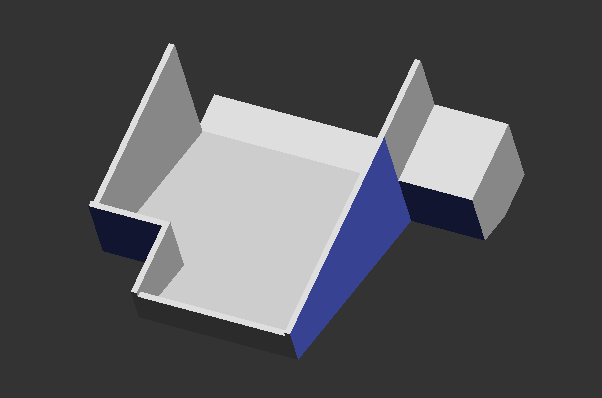
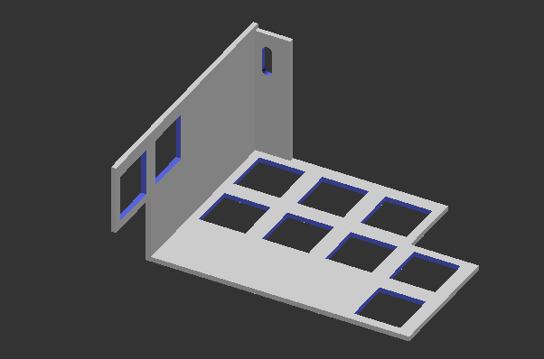
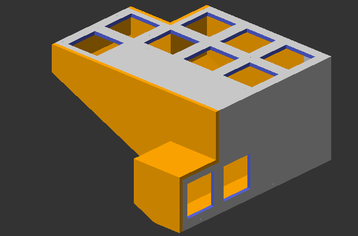

# USB-C Chorded Keyboard

Jordan Dehmel, 2026, MIT license

## About

This is a 10-key, one-handed chorded USB-C keyboard using a
scheme I made up. Each finger is responsible for two keys:
up and down. Only one is expected to be pressed down at a time.
Therefore, each of the 5 fingers has 3 states, leading to
$3^5 = 243$ combinations ($242$ if you don't count the empty
configuration). A chord will be denoted by a 5-character string,
with `U` meaning up, `D` meaning down, and `0` or space meaning
none. I will assume that the keyboard is being used in the left
hand, because I use a mouse in my right hand and therefore the
left is free. As such, we will use the string "`UUDD0`" to
denote the chord "pinky up, ring finger up, middle finger down,
pointer finger down, thumb not pressing either". We will use the
same string, even if the keyboard is being used in right-handed
mode.

The encoding scheme is really a separate project for me, I've
previously written drivers supporting it on QWERTY keyboards. I
just thought it would be cool to have a real version. This
keyboard is both chorded (each keystroke requires multiple
keys to be pressed) and corded (it is not bluetooth).

(If you're wondering why the pinky keys are so low, my
pinkies are just like that! They can't even reach the number
row or backslash on a regular keyboard.)

## The Schema

The idea with the included schema is to mimic the left hand's
QWERTY operations on home row and the row above as closely as
possible. The thumb is used to signify that the chord is
complete. Pressing down with the thumb is for regular
characters, while up is for unusual characters. In situations
where the regular character is not reachable on the two rows we
have access to, I've tried to make the chord look like an arrow
pointing to that character (for instance, "v" takes the chord
"`00UD D`", corresponding to pressing "r" and "f" at the same
time in QWERTY). For characters typed by the right hand in
QWERTY, I usually have a non-adjacent finger press some lower
key (for instance, "`D00D D`" for "j"). These can be combined
(for instance, "`D0DD D`" for "h" based on "`00DD D`" for "g").

 Chord    | Character
----------|-----------------------------------------------------
 `0000 U` | tab
 `000U U` | 8
 `000D U` | right arrow
 `00U0 U` | 4
 `00D0 U` | up arrow
 `0U00 U` | 2
 `0UU0 U` | 6
 `0D00 U` | down arrow
 `0DD0 U` | windows (or corresponding)
 `U000 U` | 1
 `U00U U` | 9
 `U0U0 U` | 5
 `UU00 U` | 3
 `UUU0 U` | 7
 `UUUU U` | escape
 `D000 U` | left arrow
 `DDDD U` | caps lock
 `0000 D` | space
 `000U D` | r
 `000D D` | f
 `00U0 D` | e
 `00UU D` | enter
 `00UD D` | v
 `00D0 D` | d
 `00DU D` | t
 `00DD D` | g
 `0U00 D` | w
 `0UU0 D` | backspace
 `0UUU D` | 0
 `0UD0 D` | c
 `0D00 D` | s
 `U000 D` | q
 `U00D D` | p
 `UD00 D` | x
 `UDUD D` | z
 `D000 D` | a
 `D00U D` | u
 `D00D D` | j
 `D0U0 D` | i
 `D0UD D` | b
 `D0D0 D` | k
 `D0DU D` | y
 `D0DD D` | h
 `DU00 D` | o
 `DUD0 D` | n
 `DUDU D` | m
 `DD00 D` | l

## The Physical Keyboard

This section describes how to assemble the core keyboard. This
is not ergonomic at all because it is intended to be modular.
However, the main module is all I have designed so far! If you
make any good ergonomic pieces, please let me know and/or pull
request them to this repo, they would be greatly appreciated!

### Parts List

In addition to the 3D-printable STL files included in this
directory, the following will be needed:

- 10x unlabelled keycaps (~$5)
- 10x mechanical keyboard switches (~$5)
- 1x USB-C Arduino Leonardo (EG [Pro Micro](https://www.amazon.com/gp/product/B0B81FGBLY)) (~$15)
- A bunch of wires (~$5)
- Soldering equipment (~$20)
- Optional grip tape (EG [this](https://www.amazon.com/Rubber-Strips-Solid-Sheets-Thick/dp/B0DDQG6J5F)) (~$10)

The arduino must have at least 10 input pins, at least 1 ground
pin, and support HID and the `INPUT_PULLUP` mode. It also must
be compatible with `Keyboard.h`, which not all boards are! Make
sure your arduino is compatible before going any further!

Also, obtain copies of the included STL parts. They should be
oriented in decent 3D-printing positions, but you will probably
need supports on the `Top.stl` part.

We will call the following piece the base or bottom case:

And this piece the top or top case:

The pieces should slot together like this:

Printing these two parts via my university cost me about $5. If
you start with absolutely nothing, the entire project should
cost about $60 to make. If you already have a 3D printer,
soldering equipment, and wires, it should cost about $25. The
arduino will be soldered to, so you should use one you don't
expect back.

The design is intended to (poorly) mimic my Logitech MX Ergo
upright trackball mouse, which I love dearly and highly
recommend for anyone who works with computers. The base is
designed to support a separate upright adapter in the same vein
as that mouse.

### Step 1: Assembling Keys

Slot the switches into the switch holes in the top casing. Make
sure that they are all in the same orientation **before**
slotting them in! The case is not designed to support removing
switches. Leave the keycaps off for now, or don't- I'm not your
mom.

### Step 2: Programming the Arduino

**Make sure to edit in the values of your pins!**

First, figure out what pins you will use. This uses 1 pin per
key: **Not** a matrix system, for chording reasons. There will
be 10 data pins used overall. **Edit `generate_arduino.py`** to
add them, then run that script. If you want to edit the schema,
you can use this script to do so.

Next, connect your **HID-compatible** arduino and upload the
sketch. This document details a corded chorded keyboard, which
requires HID for the `Keyboard.h` library. Notably, ESP32's are
not supported (though if you want to deal with batteries you
could easily use one to make a wireless version).

### Step 3: Soldering

Solder all the neutral pins of the keys together and to the
ground pin of the arduino. There should now be one pin remaining
on each switch. Solder a wire from each of these to a **unique**
digital input pin on the arduino (consult your board's pinout).
**Make sure you use the same pins you configured in step 2!**
Also ensure that no two keys are wired to the same arduino
input: They must be different. There should be a total of 11
wires soldered to your arduino: 1 ground and 10 data.

(please ignore my sloppy soldering, I bought a soldering iron
and learned to use it for this)

### Step 4: Testing and keycaps

Before you seal it up, connect your arduino to a computer, put
on the keycaps, and make sure all your joints are good. Test out
the chording schema while you're at it!

### Step 5: Final assembly

First, hot glue (or whatever) your arduino into place so that
its port goes out the port hole. If you want to do any wire
management with EG kapton tape, now is the time.

Now everything should be assembled in the upper case. The only
step remaining is to attach the 2 lower case components. You can
use glue if you don't mind replacing case parts every time you
need to open it, or you can use some heat-set threaded inserts
if you want more serviceability.

Quite a sleek little unit!
